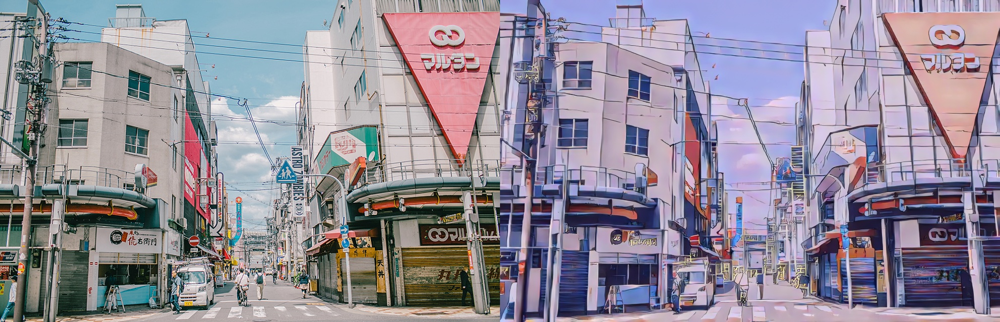

# 基于gan的图像新海诚风格化

## 数据集
|_datasets  
|__train  
|___real(真实数据)  
|___style(风格数据)  
|___smooth(经过处理的风格数据)  
## 训练
```
python train
```

## 测试
```
python test1(指定图片)

python test2(指定路径) 
```
 

## 效果





